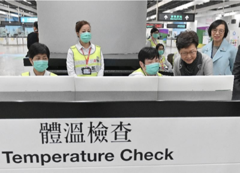

# Table of contents

1. [Detectron2 Flask API](#detectron2-flask-api)
2. [Documentation](#documentation)
    1. [Requirements](#requirements)
        1. [Docker and docker compose](#docker-and-docker-compose)
        2. [PTH model](#pth-model)
    2. [Installation](#installation)
    3. [Usage](#usage)
        1. [Endpoints](#endpoints)
        2. [Payloads](#payloads)
    4. [Example of usage](#example-of-usage)
3. [Contact and references](#contact-and-references)
4. [License](#license)


---

# Detectron2 Flask API

**Detectron2 Flask API** - is a simple `Python` written repository that allows you to run `detectron2` within **Docker** container and use `Flask` written **API** in order to interact with it.

Image, that is build in this repo works not with **GPU** (**CUDA**), but **CPU**, what allows you not to have graphic card by **NVIDIA**. More, about how everything works you will find in the [Documentation](#documentation) section.

## Documentation

The section of documentation is devided on 3 parts - [what you need](#requirements), [how you can install it](#installation) and [how you can use it](#usage).

### Requirements

#### Docker and docker compose

The **API** itself works within `Docker` container build by special image. So that, the first thing you are required to have in order to use is installed `Docker` and `docker-compose`. To check that type `docker --version` and `docker-compose --version`

```
> docker --version
Docker version 20.10.21, build baeda1f
```

```
> docker-compose --version
Docker Compose version v2.12.2
```

#### PTH model

The second thing you need to have is build `model_final.pth` trained model. More about what `model_final.pth` means and what is used for you can read [here](https://fileinfo.com/extension/pth).

>A PTH file is a machine learning model created using PyTorch, an open-source machine learning library. It contains algorithms used to automatically perform a task, such as pscaling or identifying an image. PTH files can be used in a variety of machine learning and algorithm-related applications, but are most commonly used to upscale images.

Not going deep in details you will need prepare to sets of data - for **testing** and **traing** using [labelme](https://github.com/wkentaro/labelme). Then you need to convert those 2 sets to **COCO** format, because this format is read by `detecton2`.

Here is how after convertion to **COCO** your sets of data are supposed to look:

```
├── test
│   ├── 1.png
│   ...
├── test.json
├── train
│   ├── 21.png
│   ...
└── train.json
```

In order to train model in normal preiod of time (because one way or another training **GPU** will make the whole process faster than training on **CPU**) and for free, you can use **Google Colab**.

The only thing you are required to do, is in **Runtime** settings **change runtime time** to GPU, *but be careful with that, since amount of resources you are allowed to use is limited. Use this method only for testing purposes.*

Script and step-by-step instuction of how you can generate your own `model_final.pth` model can be found in [this](google-colab-training-script) folder.

### Installation

In order to install, using terminal, open folder where you want to save and type:

```
git clone https://github.com/bl4drnnr/detectron2-flask-api.git
```

In order to use application, what you need to do is to put `model_final.pth` in `/input/pth_model` folder and input files in `/input/images` folder. Actually, both steps are optional since the folder within containder is mapped with your local folder. Therefore, you can build your own image and conteiner first and only then put model and files.

In order to build image using `docker-compose` in the root of the project type:

```
EXPOSE_PORT=8080 APPLICATION_PORT=5000 docker-compose up --build -d
```

The value of the variable `EXPOSE_PORT` is the port on which application will be available on the host machine. Setting value of `APPLICATION_PORT` variable is optional since it's port on which application works within container and it's not exposed.

Also, flag `-d` is also optional. It allows to start container in detach mode, what allows you to use termainl command prompt right after start.

### Usage

Depending on what endpoint you are going to use, payload for it will different.
Below you will find list of available endpoints and payloads for them.

In any particular case, the very first step you need to do everytime is to put `model_final.pth` model into `/input/pth_model` folder.

#### Endpoints

There are 3 endpoints available to use.

1. `POST /api/detect-area-base64` - this endpoint receives `base64` encoded picture string. As a result, you will get another `base64` encoded string with bounded boxes and detected areas.
2. `POST /api/detect-area-all` - you can put images you want to detect areas for into `/input/images` folder and trigger this endpoint. As a response you will get `base64` encodede strings with outputs in form of bounded boxes and detected areas.
3. `POST /api/detect-area-by-name` - works in the same way as `POST /detect-area-all` endpoint, but the only thing you need to do is to specify image(s) you want to detect areas for.

#### Payloads

All payloads have JSON format. As a value of every required value will be provided data type of what should be put for this particular value.

1. For the `POST /api/detect-area-base64` endpoint required payload looks next:
    ```json
    {
        "threshold_value": "number",
        "image_string": "base64_str",
        "output_image_name": "str",
        "input_image_name" : "str"
    }
    ```
2. Endpoint `POST /api/detect-area-all` requires only `threshold_value`. The only thing that should be done before usage of this endpoint is that `model_final.pth` model should be placed in `/input/pth_model` folder and pictures for processing should be placed in `/input/images` folder.
    ```json
    {
        "threshold_value": "number"
    }
    ```
3. For the `POST /api/detect-area-by-name` enpodint required payload looks next:
    ```json
    {
        "image_names": "array_of_pictures_names"
    }
    ```

### Example of usage

Let's say we have trained model that is able to recognize people in masks on photo.
What we can do is to take some picture, convert it to `base64` format and then send this picture on `POST /api/detect-area-base64` endpoint. For the purpose of help, you can use `convert_image_to_base64.py` script in root of the project.

Here is how picture in its normal `.png` format:



Then, we convert it to `base64` and the required payload will be looking like this:

```json
{
    "input_image_name": "my_input_image.png",
    "output_image_name": "my_output_image.png",
    "threshold_value": 0.5,
    "image_string": "iVBORw0KGgoAAAANSUhEUgAAAZAAAAEhEAYAAAABuSpfAAAMTmlDQ1BJQ0MgUHJvZmlsZQAASImVVwdYU8kWnltSSWiBUKSE3kQRBAJICaFFEJAqiEpIAgklxoSgYmcRFVy7iIINXRVRdC2ArBV1rYtidy2LBZWVdXEVGypvUkDXfeV75..."
}
```

As a result you will get next JSON response:

```json
{
    "data": {
        "detected_bounding_boxes": [
            [
                {
                    "box_0": [
                        133.08290100097656,
                        52.93942642211914,
                        152.4962158203125,
                        71.01234436035156
                    ]
                },
                {
                    "score_0": 0.9737352132797241
                }
            ],
            [
                {
                    "box_1": [
                        55.689701080322266,
                        99.22406005859375,
                        81.0321044921875,
                        118.78961944580078
                    ]
                },
                {
                    "score_1": 0.9538251757621765
                }
            ],
            [
                {
                    "box_2": [
                        242.28228759765625,
                        104.80382537841797,
                        266.742919921875,
                        125.33007049560547
                    ]
                },
                {
                    "score_2": 0.8988789319992065
                }
            ],
            [
                {
                    "box_3": [
                        282.64892578125,
                        21.308473587036133,
                        324.9275817871094,
                        37.22532653808594
                    ]
                },
                {
                    "score_3": 0.09363771229982376
                }
            ]
        ],
        "output_image": "iVBORw0KGgoAAAANSUhEUgAAARgAAADKCAIAAADxbchLAAAgAElEQVR4AZTBeaxe930m9uf5...",
        "partial_images": [
            {
                "partial_image_0": "/9j/4AAQSkZJRgABAQAAAQABAAD..."
            }, 
            {
                "partial_image_1": "/9j/4AAQSkZJRgABAQAAAQABAAD..."
            }, 
            {
                "partial_image_2": "/9j/4AAQSkZJRgABAQAAAQABAAD..."
            }, 
            {
                "partial_image_3": "/9j/4AAQSkZJRgABAQAAAQABAAD..."
            }
        ]
    },
    "status_code": 200
}
```

Also, in `input/images` folder you will find file with name you provided in `input_image_name` field converted to file (`my_input_images.png` in this particular case). Then, in `output/images` folder you will find file with name you provided in `ouput_image_name` field converted to file (`my_output_image.png` in this particular case), but with **bonded boxes**.


Moreover, in `output/images` folder you will find crapped every element of the object detected on the image. It has `OUTPUT_PARTIAL_IMAGE_{index}.jpg`. Index just shows the number of detected object. In this particular case there were 4. Also, in `output/string_images` you will find the same images (output images with bounded boxes and crapped elements) but in `base64` format.

## Contact and references

- Developer contact - [mikhail.bahdashych@protonmail.com](mailto:mikhail.bahdashych@protonmail.com)
- Detectron2 GitHub repository - [link](https://github.com/facebookresearch/detectron2)
- Detectron2 installation instruction - [link](https://detectron2.readthedocs.io/en/latest/tutorials/install.html)
- Detectron2 official documentation - [link](https://detectron2.readthedocs.io/en/latest/index.html)
- Flask official documentation - [link](https://flask.palletsprojects.com/en/2.2.x/)
- Google Colab - [link](https://colab.research.google.com/)
- Google Colab detectron2 tutorial - [link](https://colab.research.google.com/drive/16jcaJoc6bCFAQ96jDe2HwtXj7BMD_-m5)
- Detectron2 : The bare basic end to end tutorial - [link](https://towardsdatascience.com/detectron2-the-basic-end-to-end-tutorial-5ac90e2f90e3)
- `labelme` official repository - [link](https://github.com/wkentaro/labelme)
- `labelme2coco` official repository - [link](https://github.com/fcakyon/labelme2coco)

## License

Licensed by [MIT License](LICENSE).
